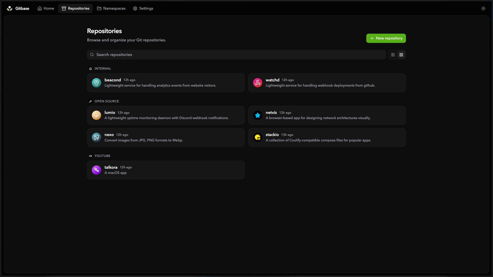
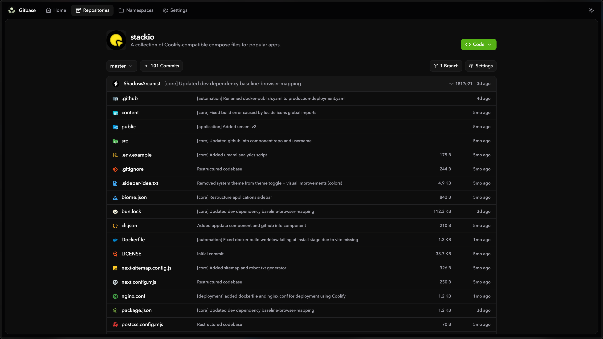
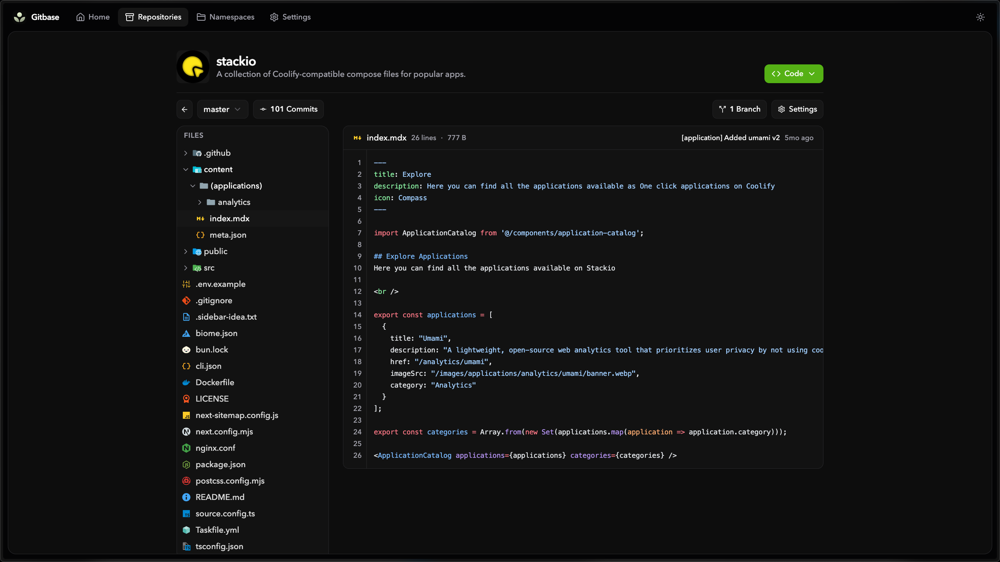
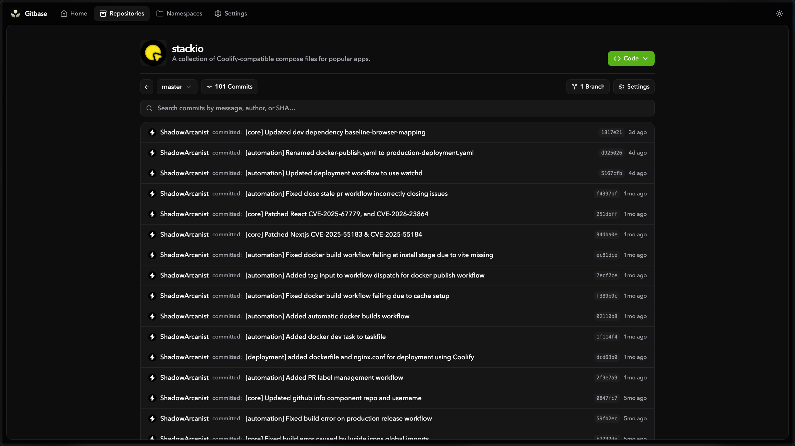

# Gitbase

A lightweight, self-hosted Git server with a web UI. Create, browse, and manage repositories on your own servers.

<table>
<tr>
 <td>Repositories
 <td>Repository View
<tr>
 <td>

 <td>

<tr>
 <td>File Viewer
 <td>Commits
<tr>
 <td>

 <td>
   
</table>

> [!IMPORTANT]  
> This project was entirely created using AI, but the application has been thoroughly tested.
> 
> This project was built primarily for my personal use, so I will not be merging pull requests or adding new features unless I need them myself. If you want to make changes or add features, feel free to fork this repository.

## Features

- **Repository management** — Create, import, delete, and configure repositories
- **Import from URL** — Import repositories from GitHub, GitLab, etc. (supports private repos with access tokens)
- **Namespace organization** — Group repositories into namespaces with custom images and descriptions
- **File browsing** — Navigate file trees with breadcrumbs and sticky sidebar
- **Syntax highlighting** — 30+ languages via Shiki (JS, TS, Go, Rust, Python, etc.)
- **Image preview** — PNG, JPG, AVIF, GIF, WebP, SVG, ICO, BMP with SVG code/preview toggle
- **README rendering** — GitHub Flavored Markdown with alerts and syntax-highlighted code blocks
- **Commit history** — Browse, search, and view commits with unified diffs
- **Branch management** — Create, delete, search branches and set default branch
- **SSH clone and push** — Built-in SSH server with key management and host fingerprint display
- **HTTP clone and push** — Git smart HTTP transport
- **Dashboard** — System stats (disk, RAM), repo/namespace counts, and activity log
- **Search** — Filter repositories, namespaces, commits, and branches
- **List/grid views** — Toggle between table and card layouts (persisted in localStorage)
- **Light and dark theme** — With matching syntax highlighting themes

## Limitations

- Single-user only — no authentication or user accounts
- No issues, pull requests, or code review
- No forking or merge workflows
- No webhooks or CI/CD integrations
- No repository wiki or project boards
- No fine-grained access control or permissions
- No email notifications
- No repository mirroring or scheduled sync

## How to Deploy

You can deploy Gitbase using the provided Docker Compose file or through Coolify.

<strong>Deploy Using Docker Compose</strong>

1. Create a `compose.yaml` file on your machine and paste the contents of the `docker-compose.yaml` from this repo.
2. Run `docker compose up` to launch the containers.
3. Visit `http://localhost:3000`

<strong>Deploy Using Coolify</strong>

1. Add a new resource in Coolify → "Docker Compose Empty."
2. Paste the contents of the `coolify.yaml` from the repo into the input field.
3. Click "Deploy!"

## Configuration

Supported environment variables

| Variable | Default | Description |
|---|---|---|
| `GITBASE_ADDR` | `:3000` | HTTP listen address |
| `GITBASE_DATA` | `./data` | Data directory (database + repos) |
| `GITBASE_PUBLIC_URL` | | Full URL when behind a reverse proxy |
| `GITBASE_MAX_BLOB_BYTES` | `5242880` | Max file size to display (5 MB) |
| `SSH_ENABLED` | `false` | Enable SSH server for clone/push |
| `SSH_PORT` | `2222` | SSH listen port |
| `SSH_HOST` | `0.0.0.0` | SSH listen host |
